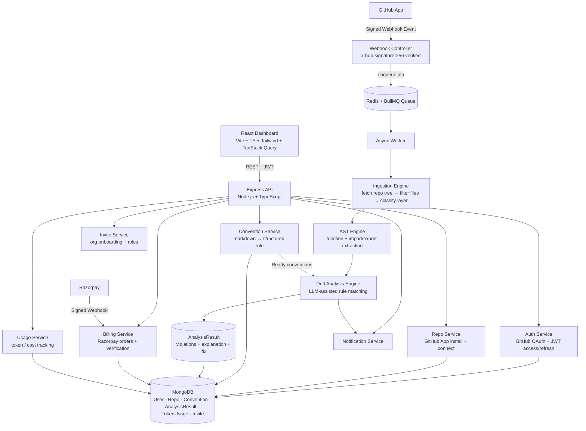
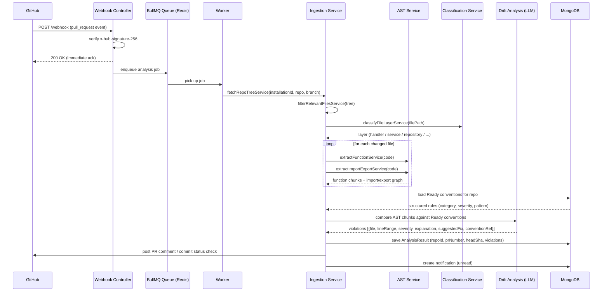
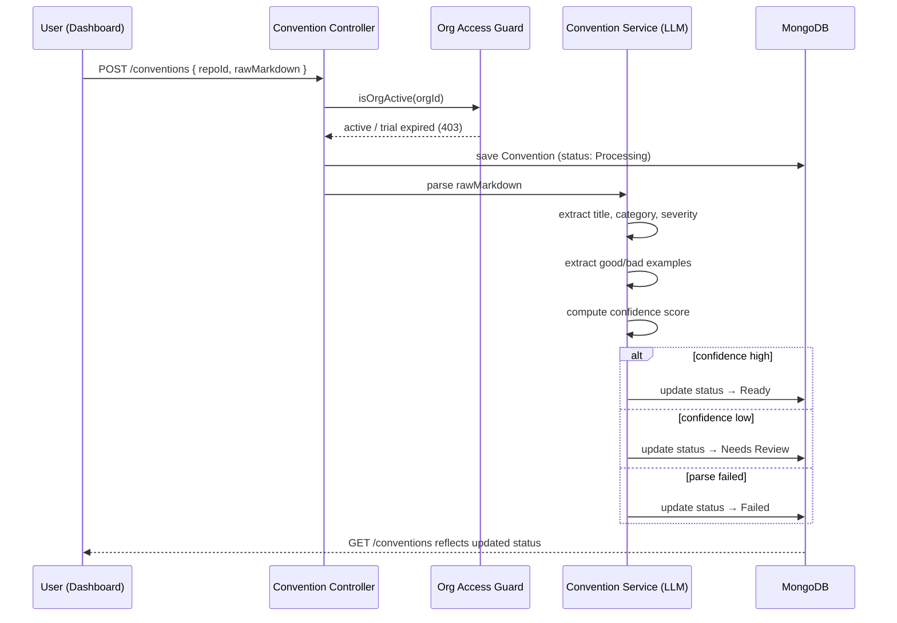
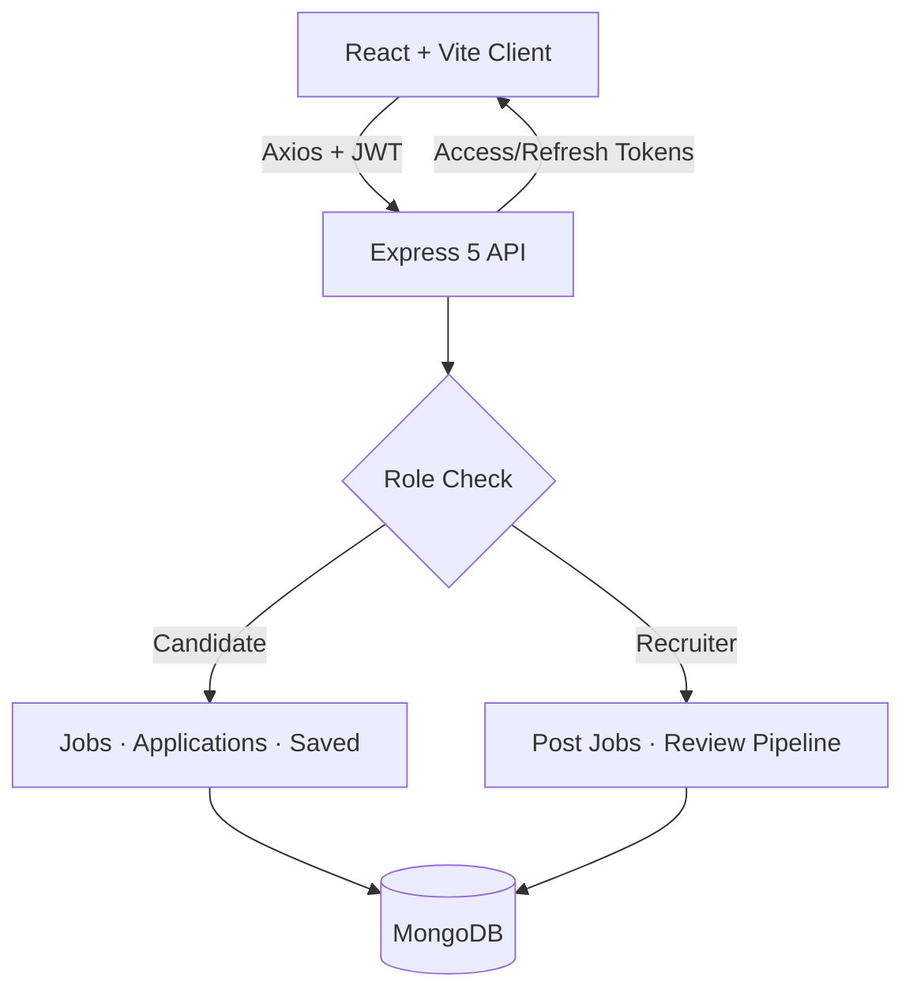
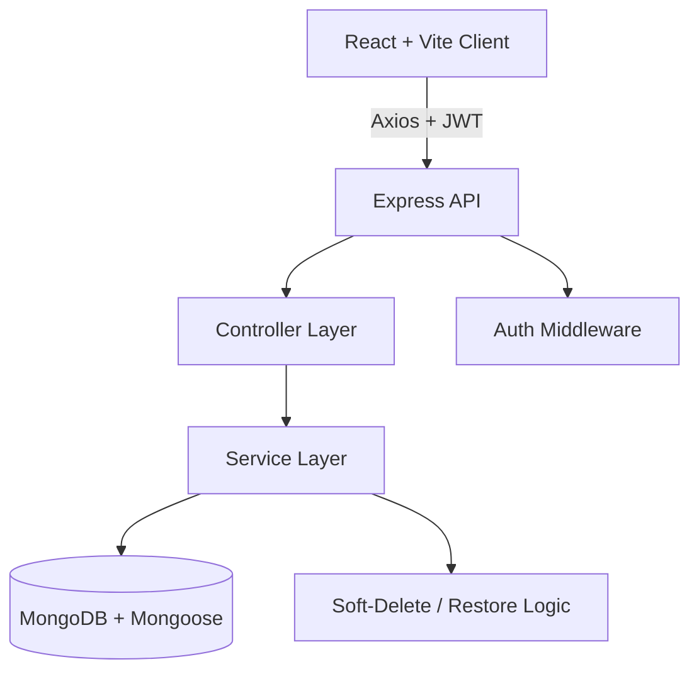
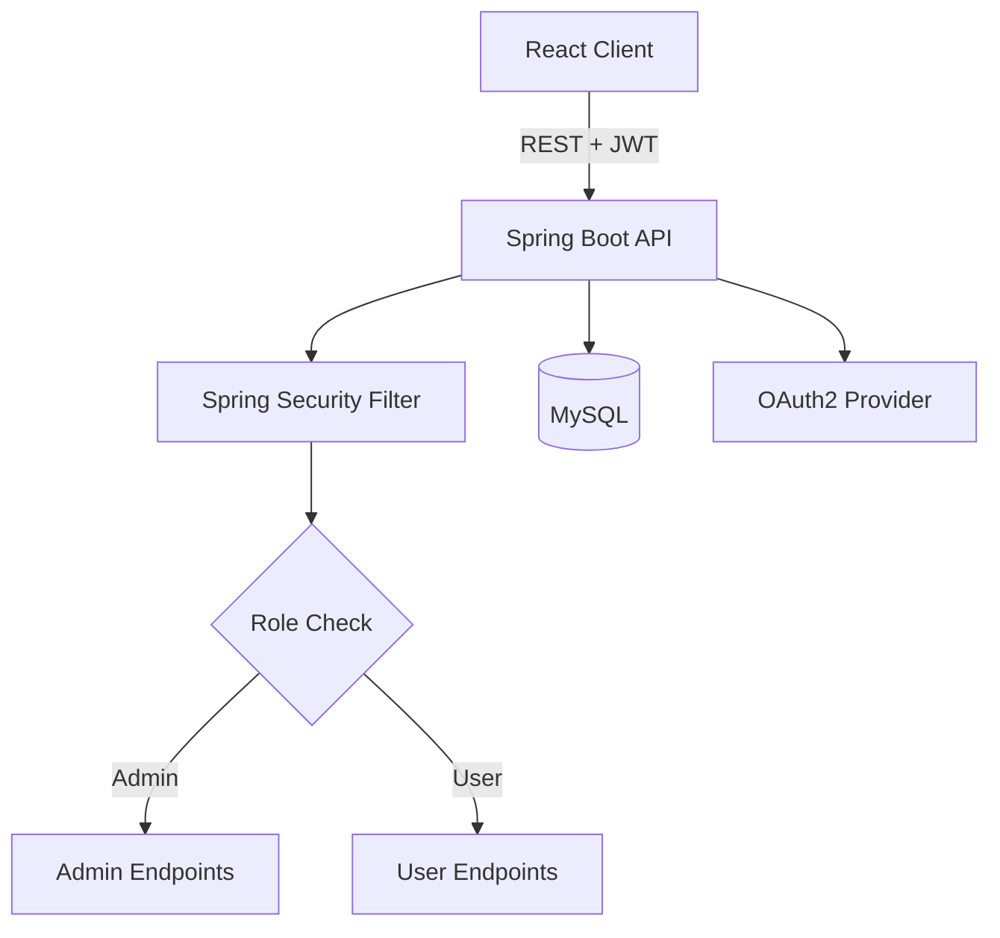

<!-- Header -->
<div align="center">
  
  <h1>Sanjay Kumar</h1>
  <p><b>Full Stack Developer (MERN + Java) | Building AI-Powered Dev Tools</b></p>
</div>

<p align="center">
  
</p>

<p align="center">
  <a href="https://www.linkedin.com/in/sanjayjaidev"></a>
  <a href="mailto:sanjayk.dev.ai@gmail.com"></a>
  <a href="https://x.com/SanjayJava6006"></a>
  <a href="https://github.com/fullspectrum-dev"></a>
  
</p>

<div align="center">

|  |  |  |  |
|:---:|:---:|:---:|:---:|
| 🛡️ **Building DriftGuard — AI Code Governance** | 🏢 **Ex-SAG Infotech** | 🧠 **225+ DSA Problems Solved** | 🎓 **BCA — Grad 2026** |

</div>

---

## 👋 About Me

> *"I don't just write code — I build systems that scale."*

I'm a **Full Stack Developer** from Jaipur, India. I started as a **Java backend developer** with real production experience at **SAG Infotech** — shipping REST APIs and working in Agile teams. I've since gone full-stack with **React, Node.js, Express, and MongoDB**, and I'm currently deep in **GenAI-backed backend systems** — building **DriftGuard**, an AI code-governance platform that parses code with ASTs and uses an LLM to catch architectural drift on pull requests.

I believe in **learning by building** — every concept I study turns into a project, a PR, or a bug fixed in production.

```
🔭  Building        → DriftGuard (AI code governance / drift detection SaaS)
🧩  Shipping         → HireFlow (role-based recruitment platform, MERN)
🌱  Learning         → LLM orchestration, queue-based system design
🎯  Goal             → Remote Full Stack / Backend role at a high-growth startup
💬  Ask me about     → React, Node.js, Java, Spring Boot, System Design
⚡  Fun fact         → I debug faster with chai ☕ than coffee
```

---

## 🛡️ Flagship Project — DriftGuard

<p align="left">
  
  
</p>

**DriftGuard is an AI-powered code governance platform that catches architectural drift on GitHub pull requests before they merge.**

Teams write their engineering conventions in plain markdown ("handlers must not call the database directly," "always wrap errors," etc.). DriftGuard parses that markdown into a structured rule using an LLM, then checks every pull request's diff against it — using AST-based code parsing, not regex — and reports back the exact file, line range, a plain-language explanation, and a suggested fix.


**Core Capabilities**
- 🔐 GitHub OAuth login + GitHub App installation flow to connect repositories
- 📝 Markdown-to-rule engine — conventions are parsed into category, severity, confidence score, and good/bad examples
- 🌳 AST-based code analysis — function-level extraction and import/export extraction, not text matching
- 🗂️ File ingestion pipeline — fetches the repo tree, filters relevant files, and classifies each file's architectural layer
- ⚙️ Webhook-driven async pipeline — GitHub webhook events are signature-verified, acknowledged instantly, and processed in the background via **Redis + BullMQ**
- 🤖 LLM-assisted violation detection — violations returned with an explanation and a suggested fix, not just a flag
- 📊 Drift analytics — per-repo violation trends over time, plus AI token usage and cache-hit tracking per organization
- 💳 Razorpay-based billing — trial gating, plan upgrades, and signature-verified payment webhooks
- 👥 Org-based multi-tenancy — admin-controlled invites and role assignment

**[View Repository →](https://github.com/fullspectrum-dev/driftguard)**

<br/>

<details open>
<summary><b>🏗️ High-Level Design (HLD)</b></summary>
<br/>



</details>

<details>
<summary><b>🔩 Low-Level Design (LLD) — PR Analysis Pipeline</b></summary>
<br/>



</details>

<details>
<summary><b>🔩 Low-Level Design (LLD) — Convention Parsing Pipeline</b></summary>
<br/>



</details>

---

## 🔥 Other Projects

### 💼 HireFlow — Full-Stack Recruitment Platform

<table>
<tr>
<td width="55%" valign="top">

**A role-aware hiring platform connecting candidates and recruiters through one clean workflow.**


**Key Features**
- 🔐 JWT auth with refresh token rotation + role-based access control
- 🔍 Job listing with pagination, filters, debounced search
- 📝 Apply flow with duplicate-apply conflict handling
- 📊 Candidate & Recruiter dashboards with pipeline funnel charts
- 🌗 Centralized dark/light theme system

**[View Repository →](https://github.com/fullspectrum-dev/hireflow)**

</td>
<td width="45%" valign="top">



</td>
</tr>
</table>

---

### 🗂️ TeamBoard — Project Management App

<table>
<tr>
<td width="55%" valign="top">

**A full-stack task & project tracker built for small teams to plan, assign, and ship work.**


**Key Features**
- 📋 Project & task CRUD with soft-delete and restore
- 👤 Shared layout with avatar dropdown & theme toggle
- 📈 CSS-only donut chart dashboard for progress tracking
- 🔐 JWT-protected routes with `ProtectedRoute` guard
- 🌗 Centralized dark/light theme system

**[View Repository →](https://github.com/fullspectrum-dev/teamboard)**

</td>
<td width="45%" valign="top">



</td>
</tr>
</table>

---

### 🔐 Full-Stack Authentication System

<table>
<tr>
<td width="55%" valign="top">

**A production-grade auth system built with a security-first mindset.**


**Key Features**
- 🔑 JWT auth with access & refresh token expiry handling
- 🌐 OAuth2 login — Google / GitHub
- 🛡️ Spring Security role-based access control (ADMIN / USER)
- ⚠️ Global exception handling with custom error responses
- 🗄️ Optimized MySQL queries with proper indexing
- 🧱 Clean Controller → Service → Repository architecture

**[View Repository →](https://github.com/fullspectrum-dev/full-stack-Authentication-App-)**

</td>
<td width="45%" valign="top">



</td>
</tr>
</table>

---

> 📌 *DriftGuard is under active development — billing, drift analytics and the AST engine are shipped; more is on the way.*

---

## 🛠️ Tech Stack

<div align="center">

**Frontend**
<br/>


<br/><br/>

**Backend**
<br/>


<br/><br/>

**Database & Cache**
<br/>


<br/><br/>

**DevOps & Tools**
<br/>


<br/><br/>

**GenAI & LLM Engineering**
<br/>

<br/><br/>


<br/><br/>


<br/><br/>

**Vector Databases**
<br/>


</div>

---

## 📊 GitHub Stats

<div align="center">
  
  
</div>

<div align="center">
  
</div>

---

## 📈 Contribution Graph

<div align="center">
  
</div>

<div align="center">
  
</div>

---

## 🏆 GitHub Trophies

<div align="center">
  
</div>

---

## ⚡ LeetCode & GeeksForGeeks

<div align="center">
  <table border="0" cellspacing="0" cellpadding="0">
    <tr>
      <td align="center" style="padding: 15px;">
        
        <br/><br/>
        
        
        
      </td>
      <td align="center" style="padding: 15px;">
        
        <br/><br/>
        
        
      </td>
    </tr>
  </table>
</div>

---

## 🌱 Currently Learning

<div align="center">

| Track | Status |
|---|---|
| 🤖 RAG (Retrieval-Augmented Generation) | 🚧 In Progress |
| 🧬 Embeddings & Semantic Search | 🚧 In Progress |
| 🗄️ Vector Databases (Pinecone, ChromaDB, FAISS) | 🚧 In Progress |
| 🔗 LangChain / LlamaIndex Frameworks | 🌱 Learning |
| ✍️ Prompt Engineering & Fine-Tuning | 🌱 Learning |
| 🧠 DSA — Two Pointers, Fast & Slow | ✅ Completed |
| 🧠 DSA — Sliding Window | 🚧 In Progress |
| 🧠 DSA — Intervals, Heaps, Top-K, K-way Merge | ⏭️ Upcoming |
| 🏗️ System Design — HLD/LLD, CAP theorem | 🌱 Learning |
| 📦 Kubernetes | 🌱 Learning |
| 📐 Design Patterns (GoF) | 🌱 Learning |

</div>

---

## 🤝 Connect With Me

<p align="center">
  <a href="https://www.linkedin.com/in/sanjayjaidev">
    
  </a>
  <a href="mailto:sanjayk.dev.ai@gmail.com">
    
  </a>
  <a href="https://x.com/SanjayJava6006">
  
</a>
  <a href="https://github.com/fullspectrum-dev">
    
  </a>
</p>

<div align="center">
  <i>Open to remote Full Stack / Backend roles at startups — let's build something great together.</i>
</div>

---

<!-- Footer -->
<div align="center">
  
</div>
